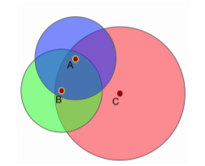

# 4.1 Introduction

이전의 chapter에서 cooperative한 상황에서 어떻게 centralised value function을 가지고, credit assignment problem을 해결할지에 대해 생각해보았습니다. 이러한 문제에 대해 많은 진척사항들이 생겼지만, 이 fully decentralised agent는 agent간의 협동하는 능력에 대해 많은 제한이 있을 수밖에 없습니다. 또한 가끔 agent들은 그들 스스로 관측한 좋은 observation에 대해서도 무시하는 경향이 있는데 이는 팀 전체로보았을 때, 내가 이 행동을 하더라도 다른 agent들이 예측가능하지않다면 전체 reward를 높이는데 어려울 수 있기 때문입니다. 이 chapter에서는 그렇기에 Multi-Agent Common knowledge Reinforcement Learning\(MACKRL\)을 제안하는데, 이는 그 두가지의 극한의 중간 영역을 찾도록 돕습니다. 이 것의 메인 아이디어로는 partially observable 상황에서 agent끼리 그들끼리 행동을 조율할 수 있도록 돕는 Common Knowledge를 가질 수 있다는 점입니다. Common Knowledge의 정의는 말이 조금 이상할 수 있지만 다음과 같습니다. 각 agent들이 모든 다른 agent들이 아는 것을 알고, 각 agent들이 다른 agent들이 모든 agent들이 알고있다는 것을 알고있는 것을 말합니다. 직관적으로 common knowledge는 서로의 상태를 서로 확인할 수 있을 때, 불확실하던 것이 사라지며 충족됩니다. 이는 다음 그림을 보며 자세하게 보겠습니다.

각 원은 각 agent 자신의 observation입니다. 이 상황에서 A와 B는 서로 관측가능하므로 Common Knowledge가 있다고 말할 수 있지만, C는 A와 B가 관측할 수 없는 위치에 존재하므로, 이는 Common Knowledge를 공유한다고 할 수 없습니다. 이는 축구같은 군집화된 상황에서 충분히 생각해 볼 수 있습니다. Common knowledge를 사용하는 것은 생각보다 꽤 유용한데 이는 그룹내의 각 agent가 스스로 그룹 내에서 공유되는 common knowledge를 추론할 수 있기 때문입니다. 결과적으로, common knowledge에 기반한 centralised joint policy가 decentralised된 방식으로 가능하기 때문입니다. 각 agent는 단지 centralised policy에서 어떤 파트의 action을 실행할지만 전달받으면 됩니다. 각 agent는 같은 common knowledge를 input으로 받기 때문에 ~~같은~~ joint action을 선택하고, 협력된 행동을 할 수 있게 됩니다.

그러나, common knowledge의 도입으로 인한 새 문제점이 생기는데, 작은 그룹일수록 겹치는 common knowledge가 많아 공유하는 양이 많겠지만, 어떤 레벨에서의 협력을 해야할지 불명확할 수 있습니다. 반대로, 협력이 완전히 전반적으로 일어난다면, 공유할 수 있는 양이 적어 fully centralised policy가 선택되겠지만, 최적의 결과를 내는데는 부족할 수 있습니다. 

그렇기 때문에, MACKRL에서는 한 팀을 얼마나 작은 그룹으로 쪼갤 것인가 결정하는것이 굉장히 중요합니다. 여기서는 계층적인\(hierarchy\) 접근을 시도했는데, 각 hierarchy에서 agent는 각 그룹내에서 joint action을 선택할 것인지, 더 작은 subgroup로 나뉠건지를 선택하는데, 그 controller의 action은 그러면 다음  hierarchy에 있는 controller로부터 선택되게 됩니다.\(controller는 agent가 아닙니다 이후에 알고리즘을 보면 이해할 수 있습니다.\) MACKRL에서의 action selection은 단순히 hierarchy에 있는 controller에 의한 sampling으로 볼 수 있습니다. 그러나 학습 중간에 joint action에 대한 marginality는 각 hierarchy마다 구할 수 있습니다. 그러므로, subgroup이 가진 parameter들이 action selection이 되지 않더라도, gradient를 받을 수 있습니다.

더 나아가 pairwise MACKRL을 발전시켰는데 이는 RNN policies가 쌍으로 협력하는 전략을 사용합니다. 이는 starcraft2 환경에서 centralised critic을 사용하는 agent baseline을 모두 압도하는 성능을 보입니다. 또한 하위 hierarchy로 결정을 넘기는 것과 common knowledge의 양 간의 유의미한 관련성을 보입니다.

