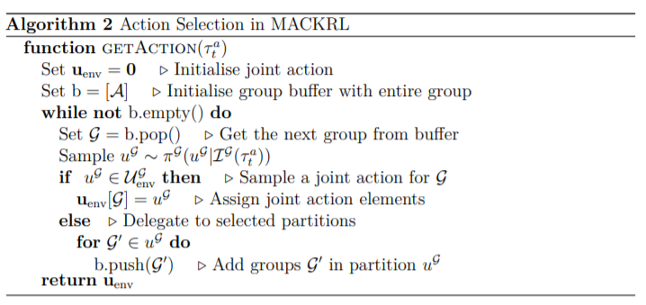

# 4.5 Multi-Agent Common Knowledge Reinforcement Learning

.., MACKRL의 주요 포인트는 협력하는 decentralised agent라는 점입니다. MACKRL은  common knowledge를 공유하는 agent들 끼리의 joint policy $$ \pi^\mathcal{G}(\bold{u}^\mathcal{G}_{env}|\mathcal{L}^\mathcal{G}(\tau^a))$$를 만드는데 이는 centralised되었지만, decentralised한 방법으로 실행됩니다.\(뒤에서 좀더 자세히 설명할 것입니다.\) 모든 agent는 common knowledge와 같은 random seed를 통해 그들이 속한 그룹의 joint action에서 action을 sampling하는 형식으로 이루어 집니다. 이때 common knowledge가 충분한 정보를 가지고 있으면, 그룹의 policy는 꽤 좋은 joint action을 내놓을 것입니다. 하지만, 충분하지않다면 작은 subgroup으로 분할됩니다. subgroup간에는 더이상 협력이 일어나진 않지만,\(joint action select에 서로 영향을 미치지않지만\) 더 풍부한 common knowledge를 사용할 수 있을 것입니다. 이 모든 과정은 partially observable 했던 trajectories를 통한 common knowledge $$ \mathcal{L}^\mathcal{G}(\tau^a)$$에 의해서만 일어나므로 decentralised되었다고 볼 수있습니다. 이러한 아이디어를 실현하기 위해 hierarchy controller를  사용하였는데, 맨 상단과 중간 level의 controller에서는 joint action을 select하거나, subgroup으로 나누는 역할을 하고, 맨마지막에선 joint action에서 action을 select하는 행위를 합니다.

알고리즘 설명이 너무 잘되어 있어 line by line 설명은 하지 않고, 전체 flow를 한번 다시 보겠습니다. b는 agent 그룹입니다. 시작은 모든 agent가 하나의 그룹입니다.

b에 더이상 쪼개질 그룹이 없다면 멈추게 되는 loop를 만듭니다.

b에서 그룹하나를 pop한뒤, 그 그룹에서의 joint action $$u^\mathcal{G}$$를 sampling합니다.

만약 이 joint action $$u^\mathcal{G}$$가 $$u^\mathcal{G} \in \mathcal{U}^\mathcal{G}_{env}$$라면, joint action에 선택되고, 그게 아니라면, group은 모두 쪼개져 b로 들어가게 됩니다. 그렇게해서 joint action $$ \bold{u}_{env}$$가 선택됩니다.

이 때, policy에 대한 marginality를 구하기 위해서 joint policy를 다음과 같이 유도합니다. 

                                     $$ P(\bold{u}_{env}|s) = \sum_{\mathrm{path \in Paths}}{P(\bold{u}_{env}|s,\mathrm{path})P(\mathrm{path}|s)}$$

Paths는 hierarchical controller가 할 수 있는 모든 action에 대한 경우로, path는 action selection을 통해 얻은 가능한 결과값중 하나입니다. 하지만 agent가 많아질 수록, logit 개수가 지수적으로 증가합니다. 거기다가 추론해야하는 joint probability는 central state information이 필요한데, 이는 더이상 decentralised 되었다고 할 수 없게됩니다. 

MACKRL에서는 hierarchical하고 decentralised된 action selection때문에, marginal probability는 joint probability를 뽑는 과정을 학습될 때만 얻으면 되는 것입니다.

이러한 policy를 학습시키기 위해서 chapter 3와 비슷한 centralised baseline을 가져왔는데, 반면에 MACKRL는 이미 joint action space에 대한 probability를 유도할 수 있으므로, COMA의 baseline은 적용할 수가 없었습다.

하지만 많은양의 partition과 partion당 그룹은 학습을 어렵게 하는 요인인데 다음장에서 어떻게 쉽게 다룰 수 있게 구현하는지를 설명합니다.

