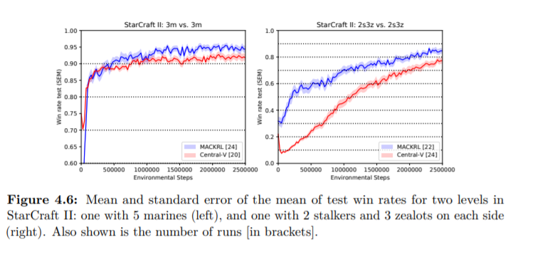
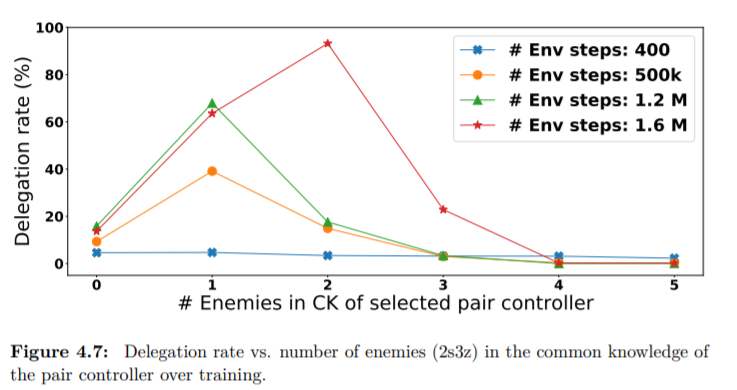

# 4.7 Experiments and Results

여기서는 MACKRL를 두가지 task에 대해 실험을 진행하였습니다. ~~이 중에서 첫번째는 partially observable한 matrix game입니다.여기서의 state는 두가지의 random하게 선택된 bit중에 하나인데 이는 iid를 따릅니다. 첫번째 비트는 information state로, 두 agent모두 관측가능합니다. 두번째 비트는~~ 

~~첫번째 비트는 common knowledge 상태의 state이고 이 common knowledge가 발생할 확률은 matrix에 있고 이는 두 agent모두 관측가능합니다. 첫번째 비트가 이 난독화 상태에 있게되면 각자의 agent는 50%의 matrix bit를 관찰해~~ 

### Starcraft II

두번째 실험은 Starcraft II micromanagement의 MARL환경입니다. 이는 starcraft의 설정과 닮았는데, 3대3 마린전, 2 스토커 3질럿전이 있는데,이전 연구에서 independent learner가 실패하는 것을 보였고, 여기서는 성공하는 것을 봄으로써, MACKRL이 유효하다는 것을 보여줍니다.

Policy의 Neural Network Architecturing에 대한 설명을 진행하는데, 두번째와 세번째 hierarchy는 parameter를 공유합니다. 그러므로, agent index나 index pair에 대한 정보를 agent에 넣어주어야 합니다.

Central-V와의 비교에서, 결론적으로 parameter수는 Central-V가 3배 적긴했지만, 결국엔 더 좋은 성능을 보인건 MACKRL이었습니다.

### Is Pair Controller really well trained to do delegate action?

pair controller가 전략적으로 delegate하는 법을 배운다는 것을 보이기 위해 아래와 같은 그림을 제시합니다. 

이는 주어진 pair controller의 common knowledge안에 있는 적에 수에 따른 delegation action $$ u_d$$에 대한 퍼센트를 나타냈습니다.학습 초기에 pair controller는 드물게 decentralised controller에게 delegate했지만, 학습진행됨에 따라, 더 자주 적당한 적의 수가 common knowledge에 있을 때, delegation하는 법을 배웠습니다. 이는 delegation이 각 agent 개인적인 observation에서의 이점을 가져가면서도, common knowledge가 있을 때 협력하는 법도 배우는 것을 알 수 있습니다.

