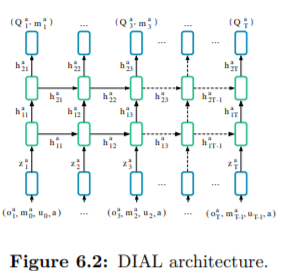

# 6.6.1 Model Architecture

RIAL과 DIAL는 모두 같은 architecture를 사용했습니다. 글이 길어지는 것을 막기 위해서 본문에서도 DIAL모델만 설명을 했는데, 그림을 먼저 보자면 아래와 같습니다.

각 agent는 RNN으로 이루어져 있으며, 이렇게 unroll하여 시점 T까지 보았을 때, 내부의 internal\(hidden\) state를 h, Recurrent layer에 data를 넣기전에 embedding한 정보에 대해 z, Q-value와 message에 대해 tuple로 나타냈습니다. input $$a$$와 $$u^a_{t-1}$$는 lookup table\(one-hot encoding같은\)을 지나 들어가고, $$m^{a'}_{t-1}$$는 1-layer MLP를 지납니다. 이를 이를 통해 모두 같은 dimension size로 embedding되고, z는 이를 단지 element-wise summation으로 구합니다.

              $$ z^a_t = \mathrm{TaskMLP}(o^a_t)+\mathrm{MLP}[|M|,128](m_{t-1})+\mathrm{Lookup}(u^a_{t-1})+\mathrm{Lookup}(a)$$

d 이를 batch-normalization등을 이용해 성능을 높일 수 있습니다. $$z^a_t$$는 2-layer RNN\(GRU\)를 지나는데, 이는 앞의 내용에서부터 실험되었듯이 partially observable상황에서 좋은 모습을 보였습니다. 그리고 2-layer MLP를 지나는데 이는 다음과 같이 표현가능합니다.

                                                 $$ Q^a_t,m^a_t = \mathrm{MLP}[128,128,(|U|+|M|)](h^a_{2,t})$$

