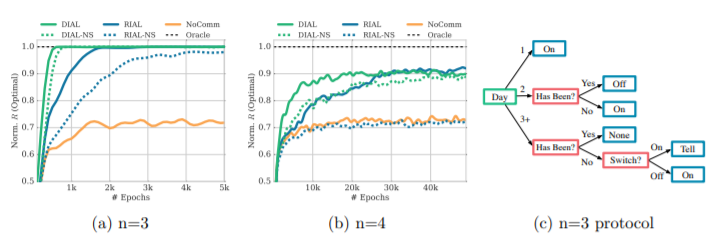

# 6.6.2 Switch Riddle

첫 experiment로 영감을 받은 것은 다음과 같습니다.

" 100명의 죄수가 새로 감옥으로 들어왔는데, 소장이 그들에게 내일부터 다 독방에 들어갈 것이고, 서로 communication은 불가능할 것이라고 알립니다. 소장은 각 날 죄수를 랜덤으로 중앙 심문실로 부를 수 있습니다. 이때 방에는 전구와 스위치만 있습니다. 죄수는 현재 전구의 상태를 볼 수 있습니다. 만약 그가 원하면 불을 켜거나 끌 수 있습니다. 가만히도 있을 수 있습니다. 가장 중요한 것은 들어갔을 때 이 켜졌는지 꺼졌는지에 대한 정보를 가지고 모든 죄수들이 이 방에 한번씩은 들어왔는지 맞출 수 있는 기회가 있습니다. 만약 이게 맞다면, 모든 죄수는 풀어지지만, 아니면 사형입니다. 지금으로 돌아와서 소장은 떠나고 죄수들끼리 그들이 어떤 룰을 세워야 그들이 완전히 모두 다 심문실에 들어갔음을 알 수 있을지 정해야하는 문제" 입니다.

### Architecture

이 문제를 해결하기 위해서 이 곳에서는 문제 정의를 다음과 같이 진행했습니다. 각 time-step t에 대해 심문실에 들어간 agent a는 $$ o^a_t \in 0,1$$를 관찰할 수 있고, message $$m^a_t$$를 남겨놓고 갈 수 있습니다. 그리고 환경에 영향을 미치는 행동으로 $$u^a_t \in \{\mathrm{None},\mathrm{Tell}\} $$을 정할 수 있습니다. reward는 Tell하기전까지 0을 받고, Tell을 해서 맞췄다면 1, 틀리면 -1로 정의하였습니다. 최대 Time-step은 너무 길어지면 너무 쉬워지므로 4n-6로 잡았습니다.

### Complexity

 이 문제는 protocol에대한 학습에 대한 과제를 제시합니다. 어느 time-step t에 대해 agent는 observation$$|o|^t$$ 를 가지는데, $$|o|=3$$으로, 취조실에 없거나, 불이 꺼진걸 보거나 불이 켜진 것을 보는 세 가지 상황을 observation가능합니다. 그리고 agent는 history로부터 $$|U||M| = 4$$가 가능한데, 그렇기 때문에, single-agent policy일 때의 space는 $$(|U||M|)^{|o|^t} = 4^{3^t}$$\(histories를 통해 action을 가지기때문에 observation 개수 만큼의 $$ |U||M|$$을 가지게 됩니다.\) 로 나타낼 수 있습니다. 그리고 최대 time step까지에 대해 고려해보면, policy space는 다음과 같습니다.

                                                                            $$\prod{4^{3^t}} = 4^{(3^{T+1}-3)/2}$$

지수 곱의 특성에 의해 지수가 등비 수열의 합 형태로 나타난 모습입니다.이게 한 agent의 action space인데, agent가 다수라면, 이를 그대로 곱하는 것과 같으므로 지수적으로 증가하는데, 이 복잡도를 Big-O를 사용하여 표현면 다음과 같습니다.

                                                                                           $$ 4^{n3^{O(n)}}$$

### Experimental Result

위 그림의 그림 \(a\)는 agent가 3명이었을 때를 나타냅니다. 5k 이후 모든 method가 optimal policy를 찾았습니다. 이때, parameter sharing하는 DIAL이 RIAL보다 빠르게 optimal에 도달하는 것을 볼 수 있었습니다. 이때, 둘다 parameter sharing이 모두 속도를 증가시킴을 알 수 있었습니다. \(b\)에서도 DIAL이 빠르게 수렴함을 볼 수 있습니다. 그리고, RIAL에 parameter sharing이 없는 것은 학습없은 baseline과 비슷함을 보아 학습이 이루어지지않고 있음을 알 수 있습니다. 이러한 결과는 agent가 communication protocol을 얼마나 힘들게 배우는지를 알 수 있습니다. 그리고 parameter sharing이 communication을 할 때 굉장히 큰 역할을 했는데, 이는 보내고 받아들이는 channel의 정보가 비슷해야 학습이 잘 이루어진다고 추측하고 있습니다. 또한 agent가 3명일때, DIAL에 대해 분석하는데, 그림 \(c\)를 보면, optimal strategy가 있습니다. 

