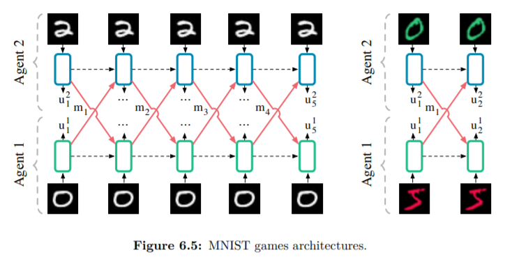
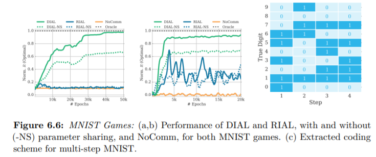

# 6.6.3 MNIST Games

여기서는 두가지 MNIST를 가지고 실험을 구성합니다.

### color-Digit MNIST

이 실험은 두 플레이어가 각자 다른 두 가지 색으로 이루어진 0부터 9 까지의 숫자를 각자 관측할 수 있습니다. 그리고, 1-bit의 정보를 보내 그림의 숫자와 색, 홀수인지에 대해 communicaiton protocol을 세우는 실험을 합니다. 각 agent는 다음과 같은 reward를 받게되고, 전체 reward는 두 agent reward의 합으로 표현됩니다.

                                                           $$ r(a) = 2(-1)^{a^a_2+c^a+d^{a'}}+(-1)^{a^a_2+c^{a'}+d^{a}}$$ 

 하지만 이 식의 reward표기에 대해 이해하지 못했습니다. $$ a^a_2$$가 의미하는 바가 어떤 건지, 어떻게 다음의 식들로 reward가 표현될 수 있는지 파악하지 못했습니다. DIAL논문에서는 정보를 전달하고, 맞추는 반복을 여러번 한 결과에 대해 표현한다곤 하는데 뭐가 됐든 의도는 파악하셨을 것이라고 생각합니다. 아래의 Multi-step MNIST를 보면 비슷한 맥락이라고 생각이 됩니다.

### Multi-Step MNIST

Gray scale MNIST data를가지고, 5번동안 1-bit communication을 하면서 0~9를 맞추는 실험입니다.5번동안 4번의 communication을 할 수 있게 되고, 이는 16bit을 전달할 수 있는 것과 같습니다. 그렇기에 각 숫자를 어떻게 bit에 효율적으로 mapping시킬 수 있을지가 관건인데, 이후에 실험 결과를 통해 어떤 결과가 나왔는지 보겠습니다.

### Architecture

network는 2개의 MLP로 이루어지고, 위의 두가지 실험의 설정은 그림과 같습니다.

### Experimental Result

위에서 소개한 두 실험의 결과를 그래프로 보면, DIAL이 모두 더 좋은 성능을 보였음을 보입니다. 그리고 이전 실험의 결과처럼 parameter sharing이 성능에 큰 영향을 끼치는 것을 볼 수 있습니다. RIAL는 학습에 실패했는데, 이는 protocol의 local minima에서 빠져나오지 못함을 볼 수 있었습니다. DIAL에서는 message protocol자체를 DQN의 error를 줄이기 위해 업데이트되므로 이런 점이 DIAL의 좋은 성능을 보여줬다고 생각합니다. 위에서 말했었던 그러면 Multi-step MNIST 실험에서 정보를 encoding했냐 했을 때, 각 숫자별로 bit별로 거의 반반을 나눠서 잘 mapping한 것을 볼 수 있습니다. 

 그리고 또 생각해보면 DIAL이 high-dimension input인 첫번째 실험에서 RIAL보다 훨씬 좋은 성능을 얻음으로써, 이를 자세히 이해하기 위해서 다음과 같은 간단한 실험을 가정해보겠습니다. 똑같은 two-agent문제로, agent 1과 agent 2의 observation $$s^1,s^2$$와 binary action $$ u^2$$에 대해 reward를 $$ (-1)^{s^1+s^2+u^2}$$로 생각했을 때, 학습이 될 때 까지, $$s^1$$에 대해 agent 2가 하는 행동에 대한 reward의 평균은 0이 될 수 밖에 없습니다. 그렇기 때문에, agent 1에 대한 TD error는 0이 됩니다.

                             $$ \mathbb{E}{[\Delta Q(s^1,m^1)] = Q(s^1,m^1)-\mathbb{E}[r(s^2,u^2,s^1)]_{s^2,u^2}= 0-0 = 0}$$

그러나 DIAL은 다릅니다. reward가 +1이든 -1이든 이 reward에 대한 signal이 전달되는데, 이 업데이트 되는 chain rule을 수식으로 나타내면 다음과 같습니다.

                 $$ \mathbb{E}[\nabla\theta] = \mathbb{E}[(Q(s^2,m^1,u^2)-r(s^2,u^2,s^1)) \frac{\partial}{\partial m}Q(s^2,m^1,u^2)\frac{\partial}{\partial\theta}m^1(s^1)]_{<s^2,u^2>}$$

특히 DIAL이 noise가 없었다면, 분포가 중앙에 모이도록 하는데, noise가 discrete한 message를 보낼 수 있도록 돕게 됩니다. 다음 chapter에선 이 noise에 대한 효과를보도록 하겠습니다.

